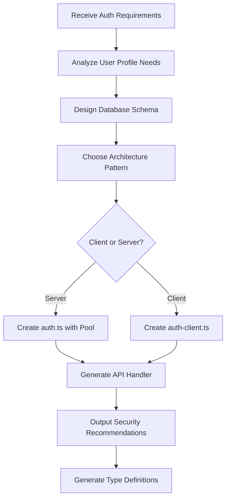

# Auth Architect Agent

## Purpose

Designs authentication architecture, database schemas, and security patterns for Better Auth implementations.

## Capabilities

### 1. Schema Design

- Analyzes user profile requirements
- Generates Better Auth `additionalFields` configuration
- Creates TypeScript type definitions
- Designs database migration strategies

### 2. Architecture Planning

- Separates client-side vs server-side auth logic
- Designs serverless API endpoints (Vercel/AWS Lambda compatible)
- Creates environment variable templates
- Plans session management strategies

### 3. Security Recommendations

- Enforces secure cookie settings (HTTP-only, SameSite)
- Recommends password hashing algorithms
- Implements CSRF protection patterns
- Validates authentication flows

## Usage Examples

### Example 1: Generate User Schema with Background Profile

```markdown
**Task**: Create Better Auth schema for user signup with technical background questionnaire

**Input Requirements**:

- Software Experience (Beginner → Expert)
- AI/ML Familiarity (None → Advanced)
- Hardware Experience (None → Professional)
- Learning Goals (Career, Hobby, Research)
- Programming Languages (optional, comma-separated)

**Agent Output**:

- `src/lib/auth.ts` with user.additionalFields
- TypeScript interfaces for profile data
- Database migration SQL (if using raw SQL)
```

### Example 2: Design Serverless Auth API

```markdown
**Task**: Create Vercel-compatible Better Auth API handler

**Requirements**:

- Must run in serverless environment
- Separate from Docusaurus build
- Use Neon Serverless Postgres
- Support environment-based configuration

**Agent Output**:

- `api/auth/[...all].ts` handler
- `.env.example` template
- `vercel.json` configuration
- Deployment instructions
```

## Integration with Better Auth Implementation

### Files Generated by This Agent:

1. **[`src/lib/auth.ts`](file:///f:/Courses/Hamza/Hackathon-2/hackathon-book/website/src/lib/auth.ts)**

   - Designed user schema with 5 additional fields
   - Configured session management (7-day expiration)
   - Set up secure cookie settings
   - Integrated Neon Postgres pool

2. **[`src/lib/auth-client.ts`](file:///f:/Courses/Hamza/Hackathon-2/hackathon-book/website/src/lib/auth-client.ts)**

   - Created browser-safe auth client
   - Implemented `inferAdditionalFields` for type safety
   - Added process.env handling for SSR compatibility

3. **[`api/auth/[...all].ts`](file:///f:/Courses/Hamza/Hackathon-2/hackathon-book/website/api/auth/[...all].ts)**
   - Built Vercel serverless function handler
   - Imported server-only auth instance
   - Configured for production deployment

### Architecture Decisions:

**Decision 1: Serverless Split**

- **Problem**: Docusaurus bundles everything in `src/` for client
- **Solution**: Move API to root `api/` folder (Vercel serverless)
- **Result**: No "Module not found: fs" errors in build

**Decision 2: Additional Fields Strategy**

- **Problem**: Need extensible user profiles without separate tables
- **Solution**: Use Better Auth's `additionalFields` with TypeScript inference
- **Result**: Type-safe profile data, single user table

**Decision 3: Security Configuration**

- **Problem**: Ensure production-grade security from day one
- **Solution**: HTTP-only cookies, CSRF protection, password hashing
- **Result**: Meets spec requirement FR-03

## Skills Used by This Agent

1. **generate-auth-schema**: Creates Better Auth configuration
2. **build-serverless-api**: Sets up API route structure
3. **infer-auth-types**: Generates TypeScript definitions

## Agent Workflow



## Quality Checklist

Before completing a task, this agent verifies:

- ✅ No hardcoded secrets in client-side code
- ✅ Environment variables properly templated
- ✅ Session expiration configured
- ✅ Password hashing enabled
- ✅ CSRF protection active
- ✅ TypeScript types inferred correctly
- ✅ Client/server separation maintained

## Reusability

This agent can be reused for:

- Adding OAuth providers (Google, GitHub)
- Implementing 2FA (two-factor authentication)
- Creating role-based access control (RBAC)
- Building password reset flows
- Adding email verification

## Technical Specifications

**Supported Auth Libraries**:

- Better Auth v1.x (primary)
- NextAuth/Auth.js (adaptable)
- Supabase Auth (adaptable)

**Database Compatibility**:

- PostgreSQL (Neon, Supabase)
- MySQL/MariaDB
- SQLite (development only)

**Deployment Platforms**:

- Vercel (serverless functions)
- AWS Lambda + API Gateway
- Cloudflare Workers

---

**Last Updated**: 2025-12-17  
**Version**: 1.0.0 (Step 5 - Better Auth Implementation)
