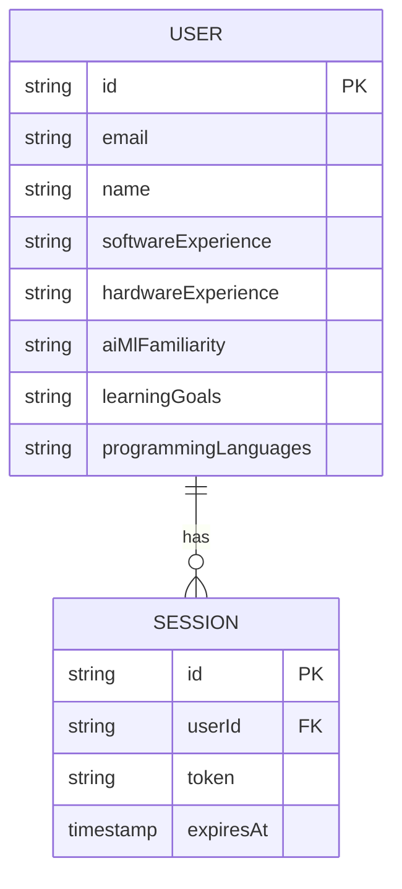

# Architecture Plan: Better Auth & Personalized Profiling

**Branch**: `3-better-auth`
**Spec Reference**: [spec.md](./spec.md)
**Target Platform**: Vercel (Serverless) + Docusaurus (SSG)

## 1. Architectural Strategy: The "Clean Break"

A significant challenge with Docusaurus is its static nature. Better Auth requires server-side logic (database connections, crypto) that Docusaurus's Webpack configuration will attempt to bundle for the browser, leading to the infamous `Module not found: fs/path/crypto` errors.

### Decision: Root-Level Serverless Functions

We will move all authentication API routes to the project root's `/api` directory.

- **Why**: Vercel maps files in the root `/api` folder to standalone serverless functions, completely bypassing the Docusaurus build process.
- **Action**: Delete `website/src/pages/api` entirely to prevent accidental bundling.
- **Handler**: `website/api/auth/[...all].ts` will serve as the unified catch-all for Better Auth.

## 2. Local Development Architecture: The "7860 Strategy"

Because `vercel dev` can sometimes be slow or restrictive for local auth testing, we will implement a dual-server local strategy:

1. **Frontend**: Docusaurus running on Port **3000**.
2. **Auth Backend**: A dedicated Express server (`auth-server.js`) running on Port **7860**.

**Proxy/Connectivity Logic**:

- The `auth-client.ts` will use environment-aware `baseURL` logic. If it detects `localhost`, it will point to `http://localhost:7860` for authentication requests.

## 3. Data Model: Extended User Profiles

We utilize Better Auth's `additionalFields` plugin to store our technical markers without requiring a separate profile table, keeping the schema lean.

## 4. UI Design System: "De-Gamified" Auth

The project's current hero section uses a "cyberpunk" theme (glowing boxes, neon text). For authentication, we shift to a **Professional Design System**.

- **Tokens**:
  - **Shadows**: Change from `glow-cyan` to `subtle-elevation` (rgba 0,0,0,0.1).
  - **Backgrounds**: Use `backdrop-filter: blur(10px)` but with neutral white/charcoal tints.
  - **Interaction**: Standard solid borders (2px) on focus instead of glowing borders.

## 5. Intelligence Integration (Step 4)

We will utilize our specialized subagents to drive this implementation:

- **Auth Architect**: Will generate the final `auth.ts` and ensure database pool management.
- **UI Designer**: Will be tasked with "De-gamifying" the CSS modules for the signup and signin forms.
- **Form Builder**: Will generate the React logic for the 9-field signup questionnaire.

## 6. Verification Plan

- **Automatic**: `npm run build` MUST complete without any Node-specific import errors.
- **Manual**: Complete a full signup flow on `localhost:3000` connected to `localhost:7860`, then verify data in the Neon Postgres console.
